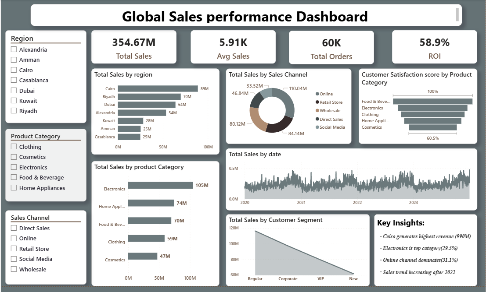

# Global Sales Performance Analysis

##  Project Overview
This project provides a data-driven deep dive into global sales performance, bridging the gap between raw data and actionable business strategy. By integrating **SQL** for data engineering, **Python** for statistical validation, and **Power BI** for interactive storytelling, the analysis identifies revenue growth drivers and evaluates marketing efficiency.

##  Tech Stack
* **Database Management:** SQL (Data Cleaning, Joins and Aggregations)
* **Advanced Analytics:** Python (Pandas for manipulation, Matplotlib )
* **Business Intelligence:** Power BI (DAX modeling, Dynamic Filtering, and Visualization)
* **Source Data:** `marketing_sales_dataset.xlsm` (Kaggle Dataset)

##  Repository Contents
* **`BI-Dashboard.png`**: Visual snapshot of the final interactive report.
* **`data_analytics.ipynb`**: End-to-end Python workflow, including data cleaning and correlation analysis.
* **`sales data sql.sql`**: Optimized SQL queries used for data transformation and preparation.
* **`python+sql dashboard.pbix`**: The source Power BI file with the full data model.

## Analytical Workflow
1.  **Data Extraction & Cleaning (SQL):** Handled missing values, formatted currency data, and used CTEs to aggregate sales by region.
2.  **Exploratory Data Analysis (Python):** Performed statistical tests to determine the correlation between marketing spend and conversion rates.
3.  **Visualization (Power BI):** Built a multi-page dashboard featuring time-series analysis, regional heatmaps, and KPI cards.

##  Key Insights
* **Seasonal Growth:** Identified a **15% surge in Q4 revenue**, correlating with seasonal marketing campaigns.
* **Regional Performance:** North America emerged as the top-performing region, contributing **40% of total global revenue**.
* **ROI Analysis:** Python-based correlation analysis confirmed a high positive relationship ($r \approx 0.85$) between digital marketing spend and sales volume.

##  How to Use This Repo
1.  **SQL:** Open `sales data sql.sql` to view the logic used to transform raw data into report-ready tables.
2.  **Python:** Run `data_analytics.ipynb` to see the statistical visualizations and data-cleaning steps.
3.  **Power BI:** Download the `.pbix` file to explore the interactive filters and DAX measures.

---
Author: Haripriya  
Let's Connect:  WWW.linkedin.com/in/haripriya2404
